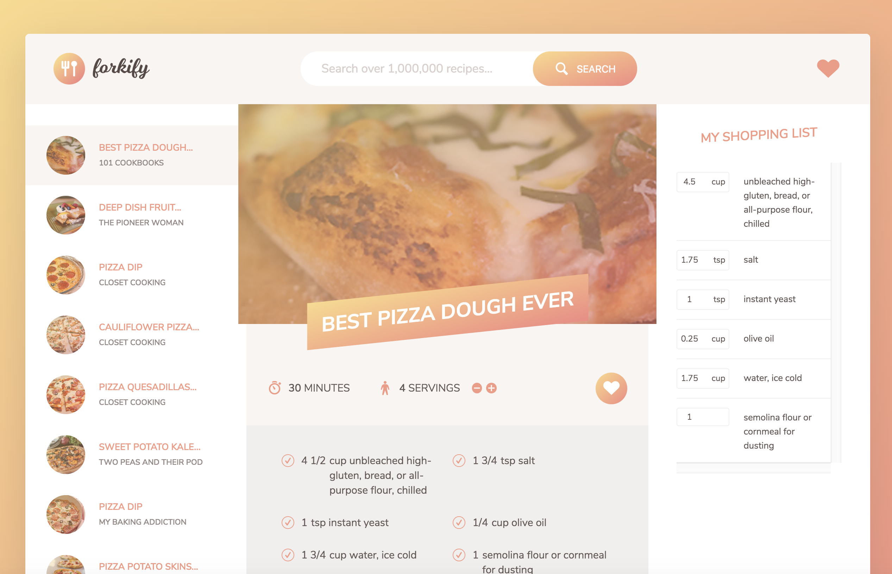

# Forkify-Project

Forkity is a project from the complete Javascript course.This project is based on some modern JavaScript features, such as Webpack, Babel, AJAX and structured in MVC.

- You can search dishes and recipes.
- Giving it a like to add your favorite dishes into shopping list.

## How to use it

1.Go to [Food2fork API](https://food2fork.com/about/api)

2.Get your API key

3.Add your API key into src/config.js

4.Run 'npm install'

5.Run 'npm run build' for production or 'npm run dev' for development purposes.

  

---

This project was design by Jonas Schmedtmann

